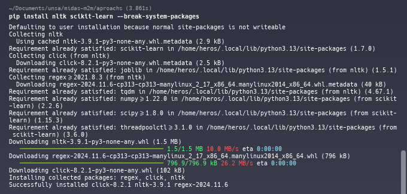
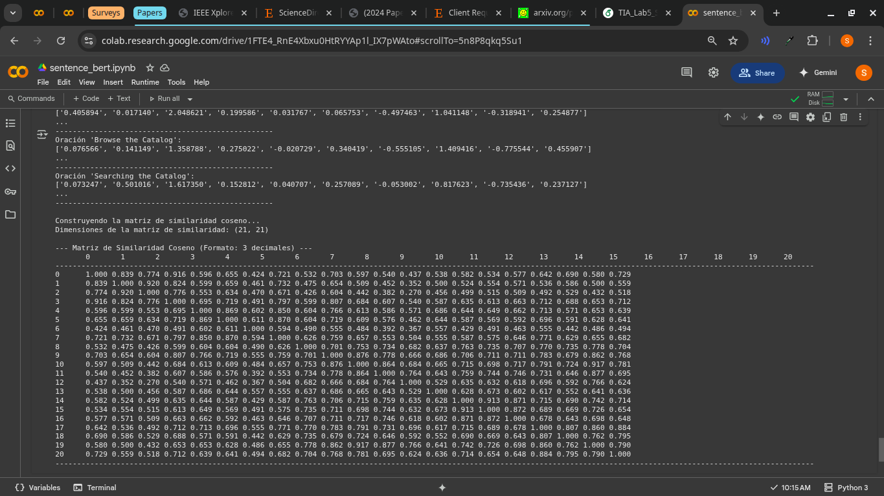
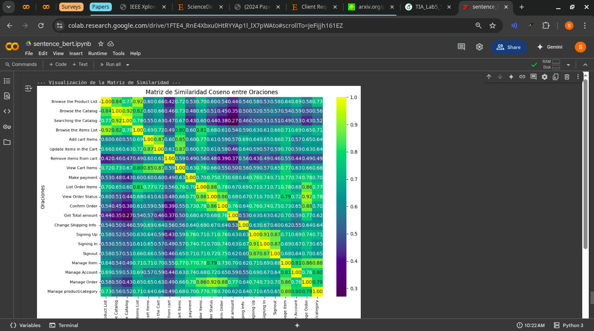

# MIDAS: MIDAS: A Multiview Graph-Based Approach for Automatic Microservice Extraction Enhanced by Domain Knowledge Using SBERT and Self-Weighted Clustering

## Prerrequisitos
- **Environment:** SO Linux/Debian 13
```sh
# neofetch
       _,met$$$$$gg.          heros@debian 
    ,g$$$$$$$$$$$$$$$P.       ------------ 
  ,g$$P"     """Y$$.".        OS: Debian GNU/Linux 13 (trixie) x86_64 
 ,$$P'              `$$$.     Host: HP Laptop 15-gw0xxx 
',$$P       ,ggs.     `$$b:   Kernel: 6.12.30-amd64 
`d$$'     ,$P"'   .    $$$    Uptime: 22 hours, 57 mins 
 $$P      d$'     ,    $$P    Packages: 2309 (dpkg) 
 $$:      $$.   -    ,d$$'    Shell: bash 5.2.37 
 $$;      Y$b._   _,d$P'      Resolution: 1366x768 
 Y$$.    `.`"Y$$$$P"'         DE: Cinnamon 6.4.10 
 `$$b      "-.__              WM: Mutter (Muffin) 
  `Y$$                        WM Theme: cinnamon (Default) 
   `Y$$.                      Theme: Adwaita-dark [GTK2/3] 
     `$$b.                    Icons: mate [GTK2/3] 
       `Y$$b.                 Terminal: WarpTerminal 
          `"Y$b._             CPU: AMD Ryzen 5 3500U with Radeon Vega Mobile Gfx (8) @ 2.100GHz 
              `"""            GPU: AMD ATI Radeon Vega Series / Radeon Vega Mobile Series 
                              Memory: 7813MiB / 13925MiB 
```

- **Version de Python:**

```sh
# python --version
Python 3.13.3
```

- **Version de GCC:**

```sh
# g++ --version
g++ (Debian 14.2.0-19) 14.2.0
Copyright (C) 2024 Free Software Foundation, Inc.
This is free software; see the source for copying conditions.  There is NO
warranty; not even for MERCHANTABILITY or FITNESS FOR A PARTICULAR PURPOSE.
```

## Ejecución

Esta sección detalla los pasos seguidos para replicar y validar el enfoque propuesto en el paper **_"Expert system for automatic microservices identification using API similarity graph"_** ([MsDecomposer](https://github.com/HduDBSI/MsDecomposer)). Los pasos se alinean con las tres partes principales del sistema descrito en el paper. Antes se instaló las dependencias:

<div align="center">
  
</div>

* **1. Preparación de Datos y Cálculo de Similaridad de API:**
    * Se extrajeron las especificaciones RESTful API del sistema legado a ser descompuesto. Esto incluyó la recopilación de `operationId` para la similaridad de tópicos y esquemas de mensajes de respuesta para su similaridad.
    * Se implementó el cálculo de la similaridad entre estas APIs. Esto se realizó combinando dos medidas: la **candidate topic similarity** (derivada de los nombres de las operaciones o descripciones) y la **response message similarity** (basada en la estructura y contenido de los esquemas de respuesta).
    * La similaridad global de cada par de APIs fue obtenida a través de una combinación ponderada de ambas medidas.

    <div align="center">
      
    </div>

    <div align="center">
      
    </div>

* **2. Construcción del Grafo de Similaridad de API:**
    * Una vez calculadas todas las similaridades, se construyó un **grafo de similaridad de API**. En este grafo, cada **nodo** representa una API individual del sistema legado.
    * Las **aristas** entre los nodos fueron establecidas basándose en la similaridad global calculada en el paso anterior. El **peso de cada arista** corresponde directamente al valor de similaridad entre las dos APIs conectadas, reflejando la fuerza de su relación semántica.

    <div align="center">
      
    </div>

* **3. Identificación de Microservicios Candidatos mediante Clustering de Grafos:**
    * Finalmente, se aplicó un **algoritmo de clustering basado en grafos** sobre el grafo de similaridad de API. Este algoritmo tiene como objetivo agrupar las APIs que exhiben una alta similaridad entre sí, formando así cúmulos cohesivos.
    * Cada uno de estos cúmulos identificados por el algoritmo representa un **microservicio candidato** para la descomposición del sistema monolítico. Los resultados fueron analizados para evaluar la efectividad de la partición.

    <div align="center">
      
    </div>

    <div align="center">
      
    </div>


Continuando con la replicación de enfoques de identificación de microservicios, esta sección describe los pasos para implementar el método propuesto en el paper "GTMicro—microservice identification approach based on deep NLP transformer model for greenfield developments". Este enfoque se centra en la identificación de contextos delimitados como microservicios para aplicaciones *greenfield*, utilizando un modelo Transformer de PNL.

**Nota: Aqui se tuvo que realizar la implementacion completa porque no habia disponibilidad de Codigo**

## Ejecución (GTMicro)

El enfoque GTMicro se basa en el análisis semántico de los casos de uso para agrupar funcionalidades y proponer microservicios. A continuación, se detallan los pasos replicados:

  * **1. Preparación de Casos de Uso y Generación de Embeddings BERT:**

      * Se recopilaron los **casos de uso** de las aplicaciones de prueba (JPetStore y TFWA), extraídos de sus documentos de requisitos.
      * Cada caso de uso fue convertido en su respectiva **representación vectorial (embedding)** utilizando un modelo basado en **Bidirectional Encoder Representations from Transformers (BERT)**. BERT fue fundamental para capturar el significado contextual y las relaciones semánticas de las frases de los casos de uso.

<div align="center">
  
</div>

<div align="center">
  
</div>


  * **2. Cálculo de la Matriz de Similaridad Semántica:**

      * Una vez obtenidos los vectores de cada caso de uso, se calculó la **similaridad coseno** entre todos los pares de vectores.
      * Estos puntajes de similaridad se utilizaron para construir una **matriz de similaridad de $N \\times N$**, donde $N$ es el número total de casos de uso. Esta matriz representa la similaridad semántica entre cada caso de uso y todos los demás.


    <div align="center">
      
    </div>

    <div align="center">
      
    </div>


  * **3. Aplicación de Clustering Jerárquico y Determinación de Clústeres Óptimos:**

      * Se aplicó un **algoritmo de clustering jerárquico** sobre la matriz de similaridad. Este método produce una presentación gráfica en forma de dendogramas, que visualizan la jerarquía de agrupamiento de los casos de uso.
      * Para encontrar el **número óptimo de clústeres** (que corresponde a los microservicios candidatos), se empleó el **método de la silueta (Silhouette method)**. Este método ayuda a evaluar la cohesión y separación de los clústeres formados.
      * Cada clúster identificado se considera un **contexto delimitado**, proponiendo así los microservicios para la aplicación. Por ejemplo, en JPetStore, se identificaron cuatro microservicios: `Account service`, `Catalog service`, `Order service` y `Frontend service`.

<div align="center">
  
</div>

<div align="center">
  
</div>

  * **4. Evaluación de la Calidad de los Microservicios:**

      * Los microservicios resultantes de la aplicación de GTMicro fueron mapeados a métricas de evaluación de calidad de software estándar (`Precision`, `Recall`, `F1-Score`).
      * Se calcularon las métricas de rendimiento para los proyectos de prueba. Por ejemplo, JPetStore obtuvo un **F1-Score de 0.95**, y TFWA un **F1-Score de 0.8205**, demostrando la efectividad del enfoque en agrupar casos de uso de manera coherente con los límites del dominio.


<!-- ## Run
- Create virtual environment:
```sh
python -m venv venv
```
- Install dependencies:
```sh
pip install -r requirements.txt
```

- Run code:
```sh
python main.py
```
- `specifications` folder contains openapi specification JSON files.  
- `results` folder is the output filepath   -->